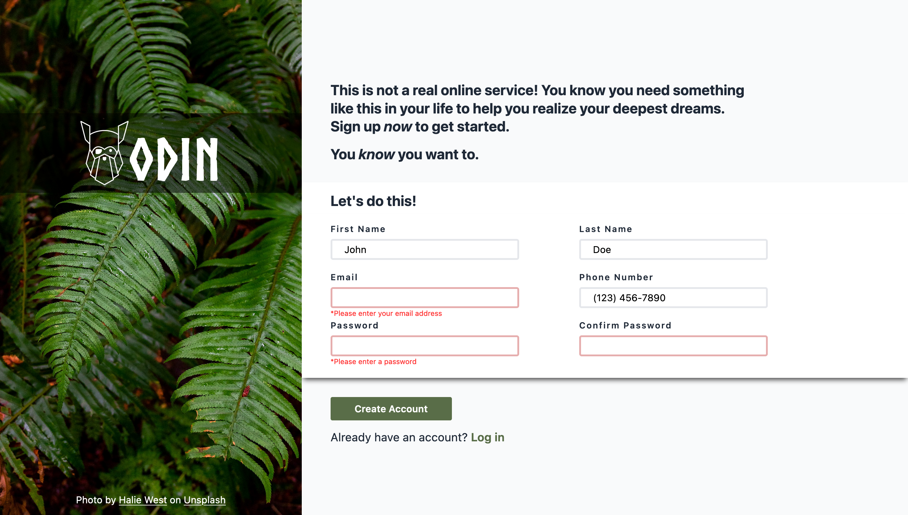

# sign-up-form

This is my solution to the [Sign-up Form from the Odin Project](https://www.theodinproject.com/lessons/node-path-intermediate-html-and-css-sign-up-form). Please do not enter any personal information into the fields.

## Overview

The goal of this project was to create a user-friendly and visually appealing form using HTML, CSS and JavaScript. The form consists of fields for the user's first and last name, email, phone number, and password. The Form is designed to display focused, invalid, and hover states for all interactive elements on the page. Users can expect to see error messages when fields do not meet the required criteria. Please note that this project does not submit data to a back-end server.

### Screenshot

### Links

- [Live Site](https://dasmith963.github.io/sign-up-form/)

## Acknowledgments

- [Design File](https://cdn.statically.io/gh/TheOdinProject/curriculum/5f37d43908ef92499e95a9b90fc3cc291a95014c/html_css/project-sign-up-form/sign-up-form.png)

- [Photo by Halie West](https://unsplash.com/@haliewestphoto?utm_source=unsplash&utm_medium=referral&utm_content=creditCopyText)

- [Unsplash](https://unsplash.com/photos/25xggax4bSA?utm_source=unsplash&utm_medium=referral&utm_content=creditCopyText)

  

